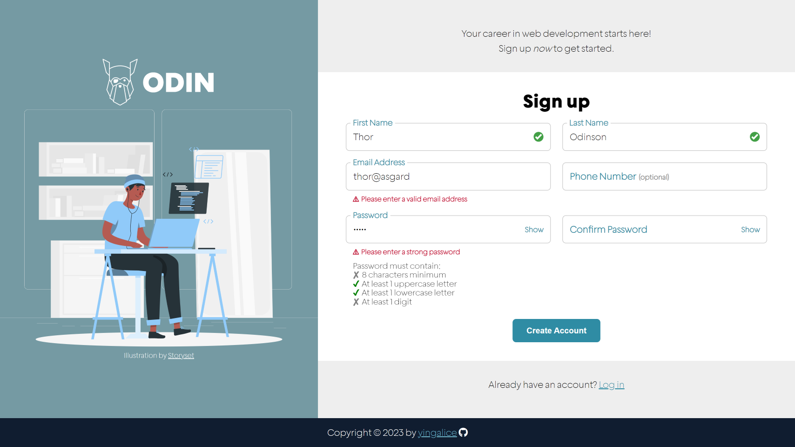

# odin-signup-form

## Live Site
- https://yingalice.github.io/odin-signup-form/

## Description
- Sign-up form with client-side validations
- Created for this [project](https://www.theodinproject.com/lessons/node-path-intermediate-html-and-css-sign-up-form) in The Odin Project curriculum

## Features
  - Real-time validation
    - Pass: Green checkmark
    - Fail: Error message
      - Note: Users are given a chance to finish typing, before any errors are shown.  Real-time validations are only activated after a field loses focus for the first time
    - Uses built-in HTML5 form validation, as well as Constraint Validation API with Javascript
  - Format phone numbers as (xxx) xxx-xxxx
  - Password checklist marks off requirements as they are met
  - Toggle password visibility (Hide/Show)
  - Smooth transitions/animations for errors/labels
  
## Goals
- Create/style forms
  - Skills: HTML/CSS
- Incorporate client-side validations
  - Skills: built-in HTML5 form validation, regular expressions, Constraint Validation Web API (with Javascript)

## What I learned
- Email validation
  - Problem: Built-in email validation treats `user@localhost` as valid
  - Solution: Add regex pattern to require a top level domain, such as `user@domain.com` 
- Hidden element's height
  - Problem: Elements with `height: 0` still show padding (used in expand/collapse animation)
  - Solution: Set padding on its child elements instead
- Autofill style override
  - Problem: `background-color` is not overrideable, as many user agent style sheets use `!important` in their `:autofill` and `:-webkit-autofill` style declarations
  - Solution: Create a large inner `box-shadow`
- Label movement
  - Effect desired: Label moves from inside a field to its top-left corner when clicked, and stays there if populated
  - Solution: Combination of absolute positioning, transitions, and determining if a field is populated
- Constraint Validation API
  - `setCustomValidity`*`(message)`* to create custom validation failures
  - `validity` to see an element's validity state, and any reasons it failed for
- Fonts
  - Download external fonts, convert to web formats .woff/.woff2, and add via CSS `@font-face`
- Responsive
  - `min()` or `max()` to establish a maximum/minimum value while growing/shrinking with screen size
  - Example: `max(2rem, calc((100vw - 450px) / 2))`

## Image Credits
- [Coding illustration](https://storyset.com/illustration/coding/rafiki) by Storyset
- [Green checkmark](https://en.wikipedia.org/wiki/File:Eo_circle_green_checkmark.svg) by Wikipedia's Emoji One contributors

## Screenshots
- Desktop  

- Mobile  
